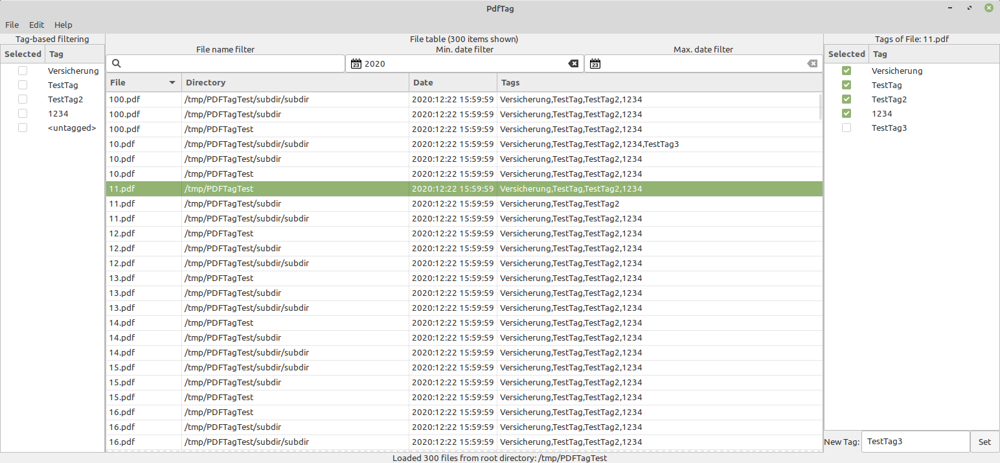

# PDFTag
A GTK3-based PDF tag (keyword) management desktop application

# Dependencies
* libimage-exiftool-perl for PDF metadata reading/modifying
* This software uses std::filesystem, so a gcc with C++17 support shall be used.
* cp

# Features
* List of all PDFs contained in the selected working directory
* Display of PDF Keywords (Tags) and PDF creation date
* Filtering via Tags
* Filtering via string (Filename)
* Filtering via Min/Max Date
* Opening files (via configurable PDF viewer)
* Saving files to destination directory

# TODO
## Table handling
* Don't lose selection on filter change as long as the selected item is available in the current filter
* Support multi-select: gtk_tree_selection_get_selected_rows
* Copy file to clipboard

## Filtering
* Update Tag-filter list in case AvailableTags changes (new tag added, tag removed from all files)
* Improve filtering: Can we just deactivate entries in table? (gtk_tree_model_filter_set_visible_func ?)
* Sorted tag list
* search query in tag list
* only display <untagged> in case there are actually untagged PDFs?
* Add selector for AND/OR combination of tags

## Other
* Integrate into deb package management to resolve dependencies and make installation easy
* Port to gtkmm
